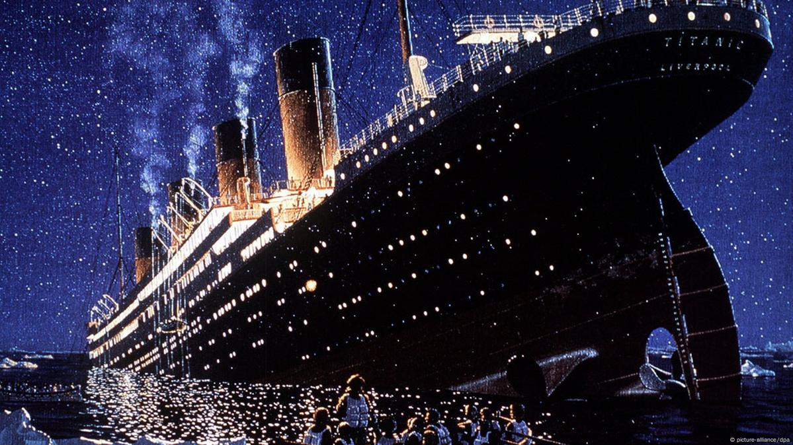

# Prodigiy-Task-2
This analysis explores survival trends among Titanic passengers, highlighting key factors that influenced survival rates.
## Exploratory Data Analysis (EDA) of the Titanic Dataset

### Dataset Overview
The dataset utilized for this analysis is the Titanic dataset, sourced from Kaggle. It contains a wealth of information regarding passengers aboard the Titanic, including their survival status, ticket prices, class, gender, and more. The analysis was conducted as part of my internship at Prodigy.
Software Used
For data cleaning, transformation, and analysis, I used PostgreSQL (PostgreSQL SQL), leveraging its powerful querying capabilities to manipulate and explore the dataset effectively.

### Project Objective 
Analyze survival rates based on passenger demographics (age, gender, and class).

Examine the impact of fare on survival probability.

Identify trends in embarkation points and their correlation with survival rates.

Compare survival rates across different socio-economic groups.

Investigate correlations between passenger attributes and survival likelihood.

Evaluate the distribution of passengers across ticket classes and its impact on survival.
________________________________________
### Data Preparation
#### Table Creation in PostgreSQL
Before importing the dataset, I structured and created a table in PostgreSQL, assigning appropriate data types to each column to ensure consistency and data integrity:

•	PassengerId: Defined as the primary key to uniquely identify each passenger.

•	Age: Initially set as INT, but later modified to DECIMAL(5,2) to accommodate decimal values such as 28.5.

•	Fare: Stored as DECIMAL(10,2), ensuring precision in monetary values.

•	Sex: Stored as VARCHAR(10), to hold categorical values such as "male" and "female".

•	SibSp, Parch, Pclass, and Survived: Stored as INTEGER for integer-based data.

•	Embarked: Stored as CHAR(1), since it contains single-letter values ('C', 'Q', 'S').

•	Zero Columns: Named initially as Zero1 to Zero19, as their significance was unclear at the time of table creation.
### Dataset Importation Challenges
A challenge arose during the dataset importation process. The Age column contained decimal values, which resulted in an error due to its initial INT data type. This issue was resolved by changing its data type to DECIMAL(5,2), ensuring smooth data ingestion.
________________________________________
### Data Cleaning Process
#### Handling Missing Values
To address missing values in critical columns, the following approaches were employed:

•	Age: Missing values were replaced with the mean age.

•	Fare: Missing values were replaced with the median fare to minimize skewness.

•	Embarked: Missing values were replaced with the most common embarkation point.
#### Handling Duplicates
A thorough check for duplicate records was conducted, confirming that no duplicate values were present in the dataset.
Handling Outliers
Outliers in the Age and Fare columns were identified. Extreme values were handled using percentile-based capping:

•	The 95th percentile was used as the upper limit.

•	The 5th percentile was used as the lower limit.

### Data Transformation
To enhance usability and interpretability, additional transformations were applied:

	Embarkation Point Mapping:
   
o	Converted numerical values to categorical labels:

	0 → 'S'

	1 → 'C'

	2 → 'Q'

	Gender Encoding:
   
o	Converted the Sex column to numerical values:

	0 → Female

	1 → Male

	Survival Status Mapping:
   
o	Transformed Survived column into meaningful labels:

	0 → No (Did not survive)

	1 → Yes (Survived)
________________________________________
### Exploratory Data Analysis (EDA)
#### Survival Rate by Age Group
To analyze survival rates across different age demographics, a new column Age_Grade was created. Passengers were categorized into the following groups:

•	Infant: 0 - 5 years

•	Child: 6 - 12 years

•	Teenager: 13 - 19 years

•	Young Adult: 20 - 35 years

•	Adult: 36 - 60 years

•	Elderly: 61+ years

### Challenges Encountered
•	Initially, the Age_Grade column had a VARCHAR(10) limit, which was too short. It was later updated to VARCHAR(20) to accommodate longer labels.

•	While executing SELECT * FROM titanic;, I encountered the error:

ERROR: cached plan must not change result type SQL state: 0A000

This was resolved by restarting the SQL tool and running targeted queries sequentially.

##### Findings
•	Young Adults (20 - 35) exhibited the highest survival rate.

•	Adults (36 - 60) followed as the second-highest surviving age group.

•	Children (6 - 12) had a moderate survival rate.

•	Teenagers (13 - 19) had the lowest survival rate among all age groups.

These insights provide valuable information for statistical modeling and understanding survival trends across age demographics.
________________________________________
### Survival Rate Analysis
This section examines the overall survival rate of Titanic passengers.

A SQL query was used to compute the number of survivors (Survived = 1) and non-survivors (Survived = 0). Additionally, the survival percentage was calculated relative to the total number of passengers.

##### Findings
•	Total passengers: 1,309

•	Survivors: 342 passengers

•	Non-Survivors: 967 passengers

•	The survival rate was significantly lower than the mortality rate, underscoring the devastating impact of the Titanic disaster.
________________________________________
### Survival and Non-Survival Rate by Gender
Gender Encoding
During data cleaning, the Sex column was converted into numerical values:

•	0 → Female

•	1 → Male

This transformation facilitated easier analysis and visualization of gender-based survival rates.

##### Grouping Data by Gender and Survival Status
The dataset was grouped by Sex (gender) and Survived status to determine survival distribution among male and female passengers.
Observations

1.	Survivors:
   
o	Males: 233 survived

o	Females: 109 survived

o	More males survived compared to females.

3.	Non-Survivors:
   
o	Males: 233 died

o	Females: 734 died

o	A significantly higher number of females perished in the disaster compared to males.

### Survival Rate by Class (Pclass)
•	This groups passengers by ticket class (Pclass) and survival status (Survived).

•	It shows how many people from each class survived or died.

Insight Example:

Pclass	         Survived	                             Count
   1	            "no"	                                187
   1	            "yes"	                                136
   2	            "no"	                                190
   2	            "yes"	                                87
   3	            "no"	                                590
   3	            "yes"	                                119

 #### Conclusion:
•	Higher-class passengers had a higher survival rate.

•	Third-class passengers had the highest death rate, likely due to limited access to lifeboats.
________________________________________
### Relationship Between Fare & Survival
#### Explanation:
•	This calculates the average fare paid by passengers who survived (Survived = 1) vs. those who didn’t (Survived = 0).

•	It helps determine if paying a higher fare increased survival chance.

Insight Example:

Survived	Avg Fare

0 (No)	25.02

1 (Yes)	41.25
#### Conclusion:
•	Survivors paid almost twice as much on average.
•	This confirms that wealthier passengers (who likely booked first-class tickets) had better survival chances.

________________________________________
### Age Distribution Among Survivors
#### Explanation:
•	This computes the average age of survivors vs. non-survivors.
•	It helps identify if age played a role in survival.

Insight Example:

Survived	Avg Age

0 (No)	29.72

1 (Yes)	28.48

#### Conclusion:
•	Survivors were slightly younger on average.

•	This suggests that younger passengers (especially children) have better survival chances.

________________________________________
### Find the Most Common Embarkation Point
#### Explanation:
•	This finds the most common embarkation point by counting passengers from each port.

•	The Titanic had three embarkation ports:

o	S = Southampton

o	C = Cherbourg

o	Q = Queenstown

Insight Example:

Embarked Count

S (Southampton)	270

C (Cherbourg)	123

Q (Queenstown)	916
#### Conclusion:
•	Most passengers boarded from Southampton.
•	Southampton passengers also had a lower survival rate since many were in third class.

________________________________________
####  Key Takeaways from EDA
•	Survival Rate: Only ~38% of passengers survived.

•	Gender Effect: More men survived than women.

•	Class Effect: First-class passengers had the highest survival rate.

•	Fare Impact: Higher fares increased survival chances.

•	Age Factor: Younger passengers had a slightly higher survival rate.

•	Embarkation: Most passengers boarded from Queenstown.
